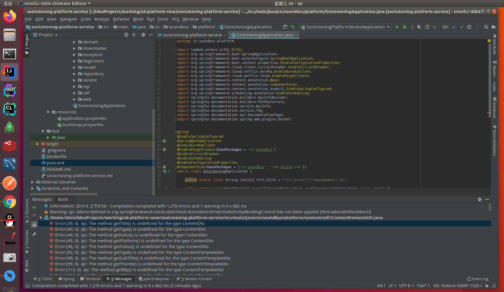

## 1.IDEA上项目启动,Ajc Error 和打包后@Autowired 注入空指针
    Ajc问题: File -> Project Structrue -> Project Settings -> Modules -> 选择项目名 -> AspectJ -> 勾选 Post-compile weave mode
        注释:保持原有Settings 配置的Use complier Ajc配置
   
   
   
   
   打包后entity中,@Autowired 注入空指针:配置build插件 -> aspectj-maven-plugin
   
   
   
   